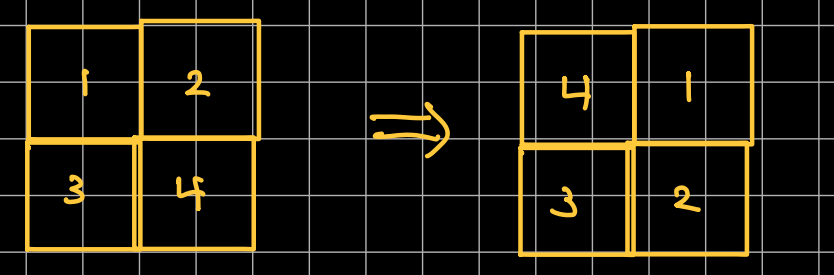
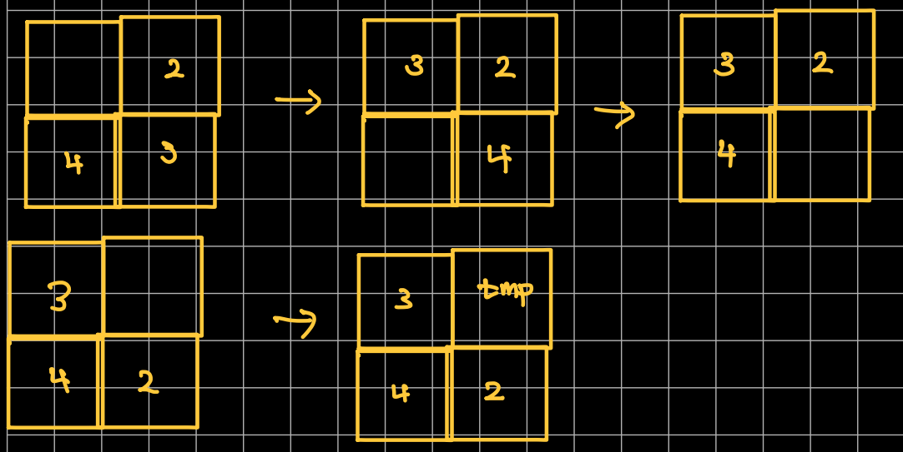

[문제 출처](https://www.codetree.ai/training-field/frequent-problems/problems/rotating-glacier) <br/><br/>


# 1. 문제설명
<hr>

- 격자에 빙하가 있고, 이를 회전시키려고 한다.
- 빙하 회전 범위 `L`이 주어지면 2의 `L`승의 제곱만큼 격자를 선택하고 4등분하여 회전시킨다.
- 회전이 끝나고 빙하에 속한 얼음이 녹게 된다.
  - 상하좌우 인접한 칸에 얼음이 3개 이상 있는 경우 녹지 않는다.
  - 그렇지 않은 경우 1이 줄어든다.
- 모든 회전을 끝내고 난 뒤 빙하의 총 양과 가장 큰 얼음 군집의 크기를 출력하라

<br/>


# 2. 입/출력
<hr>

- 입력
  - 회전 가능 레벨 `n`, 회전 횟수 `q`
  - 2의 `N`승의 제곱 크기의 빙하 정보
  - `q`개의 줄에 회전 레벨
- 출력
  - 빙하의 총 양 : 시뮬레이션 후 남아 있는 빙하의 총 합
  - 군집의 크기 : 연결된 가장 큰 덩어리의 개수

<br/>


# 3. 문제 분류
- Simulation, BFS

<br/>


# 4. 알고리즘 설계
<hr>

- 이 문제의 핵심은 빙하의 회전이다.
  - 쉽게 말해 아래와 같이 덩어리를 회전시키면 된다.

    

  - 나는 값을 하나 임시 저장하고 나머지를 밀어내는 방식을 취했다.
    
	

  - 원소를 회전시키는 것이 아니라 덩어리를 회전시키는 것에 주의하자

- `dx/dy` 테크닉
  - `4x4` 크기의 빙하를 `2x2` 크기의 빙하 4개로 쪼개고 이를 회전시킨다고 해보자
  - 각 덩어리의 시작 좌표는 1번부터 (0,0), (0,2), (2,0), (2,2)가 된다.
  - 다시말해, 덩어리마다 (x,y)에 쪼개진 빙하의 크기를 더한 것이 시작 좌표가 된다.
  - 아래는 dx, dy 배열이고 순서대로 1, 2, 3, 4번을 의미한다.
    
	```cpp
	int ddx[] = { 0,0,1,1 };
	int ddy[] = { 0,1,1,0 };
	```

  - 이제 빙하의 쪼개진 크기를 `ddx`, `ddy`에 곱해주면 된다.
    - `a`, `b`는 `x`와 `y`를 의미한다.
    - `tie(x, y) = make_pair(a + square * ddx[d], b + square * ddy[d]);`

  - 이제 덩어리 4개의 시작 좌표를 다 구했다.

- 회전
  - 배열을 회전하기 위해서 영역 1개를 임시로 저장해야 할 필요가 있다.
    - 나는 1번으로 선택했지만, 아무거나 상관없다.
  - 4번을 임시 배열 `tmp`에 순차적으로 넣는다.
  - 3번부터 1번까지 다음 위치에 값을 그대로 복사한다.
    - 반드시 뒤에서부터 해야 누락되지 않는다.
  - 이후, 4번 덩어리를 1번으로 그대로 복사한다.

  - 4개의 시작 좌표 `axis`를 순회하며 이전 위치의 값을 현재 위치로 복사한다.

    ```cpp
	pii& cur = axis[d - 1];
	pii& nxt = axis[d];

	for (int i = 0; i < square; i++) {
		for (int j = 0; j < square; j++) {
			int x, y, nx, ny;
			tie(x, y, nx, ny) = make_tuple(cur.first + i, cur.second + j, nxt.first +i, nxt.second + j);

			A[nx][ny] = A[x][y];
		}
	}
    ```

- 빙하 녹이기
  - 모든 점을 전부 탐색하면서 인접한 4방향의 숫자가 0보다 큰 것이 3개보다 적다면 녹인다.
  - 녹는 부분이 있다면 빙하의 총양에 대한 값도 1개 감소시킨다.
    - 이렇게 해야 2중 for문을 한번이라도 덜 사용하게 되겠지..
  - `melt()` 함수에 구현하였다.

- 군집 크기
  - 아직 방문하지 않은 지점의 좌표로 bfs를 수행한다.
  - 인접한 4방향으로 탐색하면서 빙하의 크기가 0보다 크면 `push`
    - `push`할 때마다 카운팅한 값이 군집의 크기가 된다.
  - `bfs(x, y)`에 구현하였다.


<br/>

# 5. 전체 코드
<hr>


#define _CRT_SECURE_NO_WARNINGS
#include <bits/stdc++.h>
using namespace std;
using pii = pair<int, int>;
using tiii = tuple<int, int, int>;

int N, Q, SZ, A[70][70], lv, sum, cluster;
int ddx[] = { 0,0,1,1 };
int ddy[] = { 0,1,1,0 };
int dx[] = { -1,1,0,0 };
int dy[] = { 0,0,-1,1 };
bool vis[70][70];

void input() {
	ios::sync_with_stdio(false);
	cin.tie(NULL);

	// freopen("input.txt", "r", stdin);

	cin >> N >> Q;
	SZ = (1 << N);

	for (int i = 0; i < SZ; i++) {
		for (int j = 0; j < SZ; j++) {
			cin >> A[i][j];
			sum += A[i][j];
		}
	}
}

void rotate(int a, int b, int len) {
	int square = len / 2;
	vector<int> tmp;
	vector<pii> axis;

	for (int d = 0; d < 4; d++) {
		int x, y;
		tie(x, y) = make_pair(a + square * ddx[d], b + square * ddy[d]);
		axis.push_back({ x, y });
	}

	pii& last = axis.back();
	for (int i = last.first; i < last.first + square; i++)
		for (int j = last.second; j < last.second + square; j++)
			tmp.push_back(A[i][j]);

	for (int d = 3; d > 0; d--) {
		pii& cur = axis[d - 1];
		pii& nxt = axis[d];

		for (int i = 0; i < square; i++) {
			for (int j = 0; j < square; j++) {
				int x, y, nx, ny;
				tie(x, y, nx, ny) = make_tuple(cur.first + i, cur.second + j, nxt.first + i, nxt.second + j);

				A[nx][ny] = A[x][y];
			}
		}
	}
	
	for (int i = 0; i < square; i++) {
		for (int j = 0; j < square; j++) {
			int x, y, nx, ny;
			tie(x, y, nx, ny) = make_tuple(last.first + i, last.second + j, axis[0].first + i, axis[0].second + j);
			A[nx][ny] = tmp[i * square + j];
		}
	}
}

void remake() {
	int len = (1 << lv);

	for (int i = 0; i < SZ; i += len)
		for (int j = 0; j < SZ; j += len)
			rotate(i, j, len);
}

bool oom(int x, int y) { return x < 0 || y < 0 || x >= SZ || y >= SZ; }

void melt() {
	vector<pii> tmp;

	for (int i = 0; i < SZ; i++) {
		for (int j = 0; j < SZ; j++) {
			int cnt = 0;

			if (A[i][j] == 0) continue;

			for (int dir = 0; dir < 4; dir++) {
				int nx = i + dx[dir];
				int ny = j + dy[dir];

				if (oom(nx, ny) || A[nx][ny] == 0) continue;
				cnt++;
			}

			if (cnt < 3) tmp.push_back({ i, j });
		}
	}

	for (auto& nxt : tmp) {
		A[nxt.first][nxt.second]--;
		sum--;
	}
}

int bfs(int x, int y) {
	int ret = 1;
	queue<pii> q;
	q.push({ x, y });
	vis[x][y] = true;

	while (!q.empty()) {
		pii cur = q.front();
		q.pop();

		for (int dir = 0; dir < 4; dir++) {
			int nx = cur.first + dx[dir];
			int ny = cur.second + dy[dir];

			if (oom(nx, ny) || A[nx][ny] == 0 || vis[nx][ny]) continue;
			q.push({ nx, ny });
			vis[nx][ny] = true;
			ret++;
		}
	}

	return ret;
}

void solve() {
	while (Q--) {
		cin >> lv;
		remake();
		melt();
	}

	cout << sum << '\n';

	for (int i = 0; i < SZ; i++) {
		for (int j = 0; j < SZ; j++) {
			if (vis[i][j] || A[i][j] == 0) continue;
			int cmp = bfs(i, j);
			cluster = max(cluster, cmp);
		}
	}

	cout << cluster;
}

int main(void) {
	input();
	solve();

	return 0;
}


<br/>

# 6. 소감
<hr>

- 배열의 값을 누적시키지 않고 잘 복사하는 것이 포인트
- 문제를 해결하고 나서 다른 사람의 코드를 살펴보았다.
  - 파이썬은... 인덱싱 기법으로 아주 간단하게 구현할 수 있더라..
- 문자열이라던가 `split`이라던가 하는 인덱싱 문제는 파이썬으로 하면 몹시 간단하다.
  - C++은 일일히 구현해야 되는데..